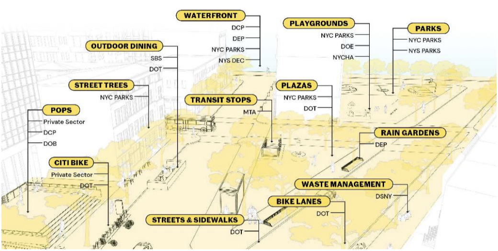

autoscale: true
## Public Drawing Precedents

### NYC Planning Urban Design Online Toolkit

---

**Objective:** Design + prototype a small collection of browser-based public drawings that communicate about urban design + physical planning issues
 
**We are thinking about:**
- exploring web dev as a way of drawing
- how to expand the approach of architectural drawing + adapt it to a new medium
- better ways to draw entities responsible for the public realm

---

Entities responsible for the public realm, Municipal Art Society 2021

---
### Narrative + Visibility of Characteristics
How do we represent spatial awareness?
What characteristics do we want visible? From an urban design perspective, what are aspects of data driven governance that are of interest to us?

3D / Immersive Experiences

- [NYTimes Chinatown Virtual Walking Tour](https://www.nytimes.com/interactive/2020/12/02/arts/design/chinatown-virtual-walk-tour.html)

- [NYTimes Tulsa Race Massacre](https://www.nytimes.com/interactive/2021/05/24/us/tulsa-race-massacre.html)

- [HIGHRISE One Millionth Tower Documentary](http://highrise.nfb.ca/onemillionthtower/1mt_webgl.php)

- [NASA Simulation](https://eyes.nasa.gov/apps/mars2020/#/home?id=heading_alignment&time=2021-02-18T15:39:51.916-05:00)

- [Santa Monica Pocket OWL](http://www.mobileowl.co/samo/#description1)

- [Philadelphia Redevelopment](https://www.arcgis.com/apps/CEWebViewer/viewer.html?3dWebScene=86f88285788a4c53bd3d5dde6b315dfe)

- [Spaces Gallery](https://www.spaces.gallery/)

- [Chatham House](https://futurescape.chathamhouse.org/)

- [Tomas Bata University](https://jenamdvacet.cz/)

- [Eurovision](https://www.eurovisionvillage.com/)

- [51World](https://www.51aes.com/technology/smart-city)

- [Jerusalem We Are Here](https://jerusalemwearehere.com/#/)

- [Bus Simulation](https://setosa.io/bus/)

- [Marseille](https://marseille.laphase5.com/en) - 3d home page, 2d elements

- [Microsoft Datacenter Tour](https://news.microsoft.com/stories/microsoft-datacenter-tour/)

- [The Biggest Change Daylight Street](https://www.thebiggestchange.com/velux-road)

2D / Line Drawing

- [NYTimes 3D Tour of Senate During Impeachment Trial](https://www.nytimes.com/interactive/2020/01/23/us/politics/impeachment-senate-chamber-diagram.html)

- [Refugee Republic](https://refugeerepublic.submarinechannel.com/)

- [Feral Atlas Map](https://feralatlas.supdigital.org/world/invasion)

- [MET Museum Map](https://www.metmuseum.org/art/online-features/metkids/explore/)

Geographic Mapping of Data

- [Hip Hop Word Count](https://tahirhemphill.com/champagne/)

- [Mapper's Delight](https://www.rapresearchlab.com/mappers-delight)

- [Manhattan Population Explorer](http://manpopex.us/)

- [LA Healthy Buildings, Healthy Places Design Guide](https://storymaps.arcgis.com/stories/fd221bd31cc14048b41e0a5d3362da68)

---
### Accessibility
Thinking proactively about: 
- internationalization
- the differently abled
- language
- graphic conventions
- what feels comfortable/familiar/inviting vs. having a tone of authority

What is intuitive, especially for the general public?

---
### Guided vs. Open Navigation

- NYTimes Immersive Experiences - 'scroll to explore'

- [Manhattan Population Explorer](http://manpopex.us/) - includes both a guided sequence + exploratory aspects

- [Bear 71](https://bear71vr.nfb.ca/) - sequenced narrative with option to jump around, exploratory aspects in each chapter

- [Tomas Bata University](https://jenamdvacet.cz/) - 'tour' option in addition to free exploration

- [Feral Atlas](https://feralatlas.supdigital.org/)

---
### Authorship
How do we treat drawing as more collaborative, especially with web dev?
How do we make these drawings/the website more democratic? Who can contribute? How can we create dialogue/start conversations through the drawing?

- [Bear 71](https://bear71vr.nfb.ca/) - beginning scene includes film credits

- [Refugee Republic](https://refugeerepublic.submarinechannel.com/) - credits tab

---
### Menu of Options
- **textual overlay on important things to note**
	- NYTimes pieces ([NYTimes Chinatown Virtual Walking Tour](https://www.nytimes.com/interactive/2020/12/02/arts/design/chinatown-virtual-walk-tour.html), [NYTimes Tulsa Race Massacre](https://www.nytimes.com/interactive/2021/05/24/us/tulsa-race-massacre.html))

- **scroll + stop to create narrative**
	- NYTimes pieces ([NYTimes Chinatown Virtual Walking Tour](https://www.nytimes.com/interactive/2020/12/02/arts/design/chinatown-virtual-walk-tour.html), [NYTimes Tulsa Race Massacre](https://www.nytimes.com/interactive/2021/05/24/us/tulsa-race-massacre.html))

- **highlighting pieces of a drawing**
	- NYTimes pieces ([NYTimes Tulsa Race Massacre](https://www.nytimes.com/interactive/2021/05/24/us/tulsa-race-massacre.html), [NYTimes 3D Tour of Senate During Impeachment Trial](https://www.nytimes.com/interactive/2020/01/23/us/politics/impeachment-senate-chamber-diagram.html))

- **different paths with different "stops"/choose your own adventure**
	- [Refugee Republic](https://refugeerepublic.submarinechannel.com/)
	- [Jerusalem We Are Here](https://jerusalemwearehere.com/#/)

- **embedded points of interest to click into**
	- [Feral Atlas Map](https://feralatlas.supdigital.org/world/invasion)
	- [MET Museum Map](https://www.metmuseum.org/art/online-features/metkids/explore/)

- **3D model simulations**
	- [51World](https://www.51aes.com/technology/smart-city)
	- [Tomas Bata University](https://jenamdvacet.cz/)

- **highlighting points of interest in the 3D space**
	- [Tomas Bata University](https://jenamdvacet.cz/) 
	- [Eurovision](https://www.eurovisionvillage.com/)
	- [Marseille](https://marseille.laphase5.com/en)
	- [Microsoft Datacenter Tour](https://news.microsoft.com/stories/microsoft-datacenter-tour/)
	- [The Biggest Change Daylight Street](https://www.thebiggestchange.com/velux-road)

- **video/text/audio annotation in 3D space**
	- [HIGHRISE One Millionth Tower Documentary](http://highrise.nfb.ca/onemillionthtower/1mt_webgl.php)
	- [Jerusalem We Are Here](https://jerusalemwearehere.com/#/)
	- [Spaces Gallery](https://www.spaces.gallery/)
	- [Chatham House](https://futurescape.chathamhouse.org/)

- **guided navigation/"tour" option**
	- [Chatham House](https://futurescape.chathamhouse.org/)
	- [Tomas Bata University](https://jenamdvacet.cz/)

- **toggles to show different scenes**
	- [Philadelphia Redevelopment](https://www.arcgis.com/apps/CEWebViewer/viewer.html?3dWebScene=86f88285788a4c53bd3d5dde6b315dfe)

- **visualization of data (population, traffic, etc)**
	- [Hip Hop Word Count](https://tahirhemphill.com/champagne/)
	- [LA Healthy Buildings, Healthy Places Design Guide](https://storymaps.arcgis.com/stories/fd221bd31cc14048b41e0a5d3362da68)

- **show change over time/timeline**
	- [Hip Hop Word Count](https://tahirhemphill.com/champagne/)
	- [Santa Monica Pocket OWL](http://www.mobileowl.co/samo/#description1)
	- [Chatham House](https://futurescape.chathamhouse.org/)

- **customizable information to display**
	- [Philadelphia Redevelopment](https://www.arcgis.com/apps/CEWebViewer/viewer.html?3dWebScene=86f88285788a4c53bd3d5dde6b315dfe)

- **public engagement surveys built into narrative**
	- [Santa Monica Pocket OWL](http://www.mobileowl.co/samo/#description1)

- **adding comments**
	- [Philadelphia Redevelopment](https://www.arcgis.com/apps/CEWebViewer/viewer.html?3dWebScene=86f88285788a4c53bd3d5dde6b315dfe)

- **run simulations**
	- [Bus Simulation](https://setosa.io/bus/)

---
### Follow-up Questions

What kinds of drawings are going to be communicated?

Who is the audience of these drawings? Who will be using this platform? How will people come into contact with this platform?

What are you hoping people get of the drawings?

How have past drawings been used for public engagement purposes?

What would be most exciting to see?

### Lucas Additional Precedents

[Museum Guggenheim Bilbao, Bilbao, Spain — Google Arts & Culture](https://artsandculture.google.com/streetview/museum-guggenheim-bilbao/6gGSw-L3-Xukfg?sv_lng=-2.934576581688561&sv_lat=43.26868278007137&sv_h=268.1713716329163&sv_p=10.954786703250448&sv_pid=YxeAeodjEbnIMX9nzBlARQ&sv_z=1.212106801078394&sv_lid=17242884745795414371)

[Virtual Tour of the Glasner Studio](https://tourmkr.com/F1d8jd7Iwl/12562351p&56.66h&72.11t)

[Our Lady of Mercy School for Young Women Virtual Tour - Build Matterport Virtual Tour | 247virtualtours.com](https://247virtualtours.com/272-our-lady-of-mercy-school-for-young-women-virtual-tour-tour)

[SUBLIME VUE MER EN HAUTEUR](https://envisite.net/vtour/en/fus8qc/frame)

[Virtual tour "New Wing"](https://www.museivaticani.va/content/museivaticani/en/collezioni/musei/braccio-nuovo/tour-virtuale.html)

[The National Museum of Computing](https://mpembed.com/show/?details=1&ga=UA-32443811-1&hdir=2&m=pq6v8gMmxMw&mdir=3&minimap=2&minimaptags=0)

[NCMNS Terror of the South](https://my.matterport.com/show/?m=7f7dLG3jXQa)