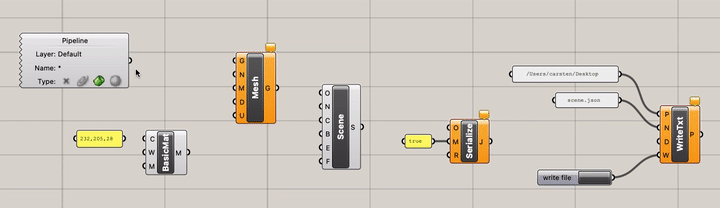

# 3D models on the web

We've covered a few ways to prepare [raster](./tutorial_raster-drawings.md) and [vector](./tutorial_vector-drawings.md) drawings for the web. Now let's look at how to do this with 3D models.

Browser-based 3D graphics have been possible since around 2007 when [WebGL](https://en.wikipedia.org/wiki/WebGL) was first introduced. Unfortunately WebGL itself is very complicated, so web developers usually use a library like [Three.js](https://threejs.org/) to compose WebGL **scenes**. Sometimes called a *scene graph*, a scene is analogous to an SVG document and brings together a collection of elements in space. Three.js provides built-in primitives like *lights*, *cameras* and simple geometries, as well as *loaders* that let you bring in models created in  Rhino, Blender and other programs. The specifics of how these are expressed and rendered onscreen with WebGL is handled "backstage" so we can focus on how our scene elements look and feel.

Loaders are good for when you want to show a single object as-is, kind of like a 3D static image, but what if you already have a detailed Rhino model including multiple elements, and you want to make it interactive? A few potential approaches are outlined below.

## Using Rhino + Grasshopper + Triceratops

Triceratops is a free Grasshopper plugin developed by Amelia Harvey at KPF that lets you compose a Three.js scene from objects in your Rhino model. If you haven't used Grasshopper much but have heard it can be a headache, don't worry, Triceratops basically just uses Grasshopper's system of nodes and wires to pipe objects into a single scene and write it to a JSON scene file that can be read by Three.js.

### Download and Install Triceratops

- In Rhino, run `GrasshopperFolders` and select "Components". The folder will appear in your system file browser – to install Grasshopper plugins, you usually just need to add the plugin file to this folder.
- To get the plugin file for Triceratops, download from [Food4Rhino](https://www.food4rhino.com/en/app/triceratops#)
- Unzip the downloaded .zip file. On Windows, make sure the .zip is [unblocked](https://www.crct.polymtl.ca/fact/facthelp/ZIP_Unblock.HTM) first.
- Drag `Triceratops.gha` from the unzipped folder to the Components folder from the first step. If Grasshopper is already running, quit and restart Rhino. The next time you open Grasshopper the plugin will be installed.

### Composing a Scene

- Triceratops works by providing Grasshopper components that can translate Rhino geometries into a Three.js-compatible JSON representation. In the component menu you'll find five groups of components:
  - Geometry – Creates meshes from surfaces, polysurfaces and meshes; lines from lines, polylines and curves; and points from points. Note there is also a flexible UserData component for arbitrary key-value pairs.
  - Materials – Creates materials for meshes, lines and points and provides helpers for adding textures.
  - Lights – Creates lights for the scene.
  - Scene – Creates fog objects and provides a scene component that to tie everything together.
  - File Management – Provides helpers to convert the scene to JSON and save as a file.
- The basic steps for adding objects to the scene are:
  - Reference geometries from the Rhino model, using a Pipeline or geometry param component
  - Pass the reference to the appropriate Triceratops geometry component (for example, Mesh for a surface, Line for a curve)
  - Apply an appropriate material to the geometry (MeshBasicMaterial for Mesh) with a color and optional texture.
  - Pass the geometry into a Scene component
  - Convert to JSON with the Serialize component and save to file with WriteTxt
- Repeat the steps above until everything that needs to be in the scene is captured

### Adding Annotations

You might have noticed that the Triceratops geometry components have a "Name" input. This can be used to add a text label to the geometry object that could then be used to render a tooltip, callout or other visual label in the browser. 

- Any text can be used, but many cases it's probably easiest to use the Rhino object name property which can be easily edited as you work to develop the model. 
- In this case, use the built-in Object Details component to pull the name from the referenced geometry and pass that into the Triceratops geometry component's name input.
- You could also load data from a spreadsheet, external text file, or edit text labels inside the Grasshopper document

An example can be seen in the [triceratops example](../scripts/grasshopper/triceratops.gh) included with this repository under `scripts`.

### Adding a Sequence of Views

A sequence of views for a guided "tour" or walkthrough of the scene can be set up in Rhino using named views. It's a good idea to use a consistent format for the name of each view, for example "1_from-street", "2_roof-deck" etc.

The example script referenced contains a component "Named Views to JSON" which can be used to export names and camera parameters of each view for use in the browser.

Another approach is to animate a camera continuously along a provided path. In this case, you can draw the camera path (and accompanying camera target path if needed) in Rhino and export with a recognizable name like `camera_path`. The animation can then be set up in Three.js by the developer.

## Using Blender via GLTF

*coming soon*
