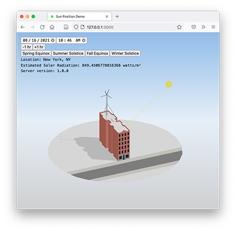

# Sun Path

Simple web app using sun position microservice.

To run:

- from `server`:
  - make virtual environment and install dependencies from `requirements.txt`
  - `source env/bin/activate`
  - `cd app`
  - `export FLASK_APP=serve`
  - `export FLASK_RUN_PORT=51051`
  - `flask run`
- from `client`: `npm start` (you may need to `npm install` first)

## Credits

- Rudransh Dikshit, Civic Innovation Corps Summer 2021
- Carsten Rodin, NYC Planning
